# Bash that Vim

My Bash and Vim config files. Maybe someone will find'em handy :)


##.bashrc
open the file and just a have a look at all the aliases

##.vimrc
F2 - toggle paste mode that will keep the indendation intact  
F4 - toggle diff of currently opened buffers/splits  
F5 - remove all trailing whitespaces  
F6 - toggle 80 chars vertical line  
F7 - toggle line numbering  
F8 - toggle tag lists (require cTags)  
F10 - toggle hex view  
F12 - toggle visual whitespaces  
C-t up/down/left/right - navigate between tabs  
C-[hjkl] - navigate between splits/buffers  
S - yank a text then use S to replace a word and paster many times  


##.inputrc 
contains a nice bash setting that allows you to search through your 
history using the up and down arrows.
i.e. type "cd /" and press the up arrow and you'll search through everything
in your history that starts with "cd /".
Thaks to Jude Robinson @ https://coderwall.com/p/oqtj8w


## Installation notes

Clone repo:
```bash
    git clone https://github.com/kowalcj0/bash-that-vim.git
```

Initialize all the submodules:
```bash
    git submodule init
    git submodule update
    # or in case you had an older version of this repo
    git submodule update --init
```

Create a backup copy of your current cfg files:
```bash
    cp ~/.bashrc ~/.bashrc.bak
    cp ~/.vimrc ~/.vimrc.bak
    cp ~/.inputrc ~/.inputrc.bak
```

Delete your old cfg files:
```bash
    rm ~/.bashrc 
    rm ~/.vimrc
    rm ~/.inputrc
    rm ~/.profile
    rm ~/.iftoprc
    rm ~/.gitignore
```

Create new absolute symlinks for all dot files and .vim folder:
```bash
    ln -sf ~/git/bash-that-vim/.bashrc ~/.bashrc
    ln -sf ~/git/bash-that-vim/.vimrc ~/.vimrc
    ln -sf ~/git/bash-that-vim/.inputrc ~/.inputrc
    ln -sf ~/git/bash-that-vim/.vim ~/.vim
    ln -sf ~/git/bash-that-vim/.profile ~/.profile
    ln -sf ~/git/bash-that-vim/.iftoprc ~/.iftoprc
    ln -sf ~/git/bash-that-vim/global_gitignore ~/.gitignore
```
This [answer](http://superuser.com/a/422477) on superuser.com to explains why 
you need to create those absolute symlinks :)


Load new Bash settings:
```bash
    source ~/.bashrc
```
or simply open new bash session to enable .inputrc

Once that done you can edit your cfg files as usual:
```bash
    vim ~/.bashrc 
    vim ~/.vimrc
```

or use handy aliases:
* ba for vim ~/.bashrc
* vv for vim ~/.vimrc


## Shortcut tutorials

* F2 paste code and keep formatting  
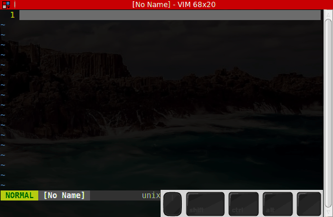
* F4 toggle diff of currently opened buffers/splits
* F5 remove all trailing whitespaces  
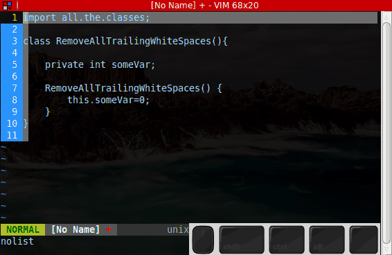
* F6 toggle 80 chars vertical line  
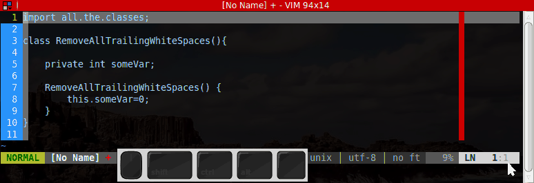
* F7 toggle line numbering  
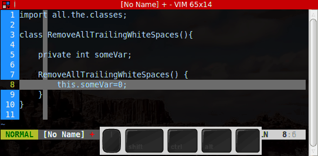
* F8 toggle tag lists (require cTags)  
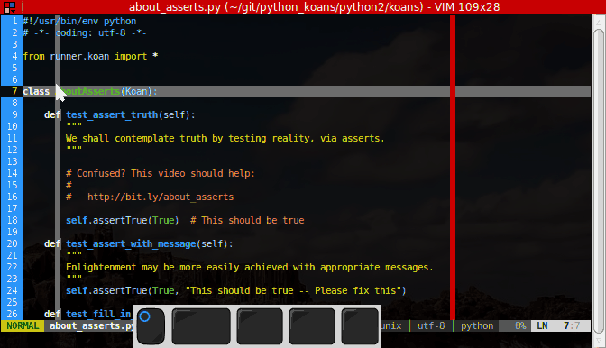
* F10 toggle hex view  
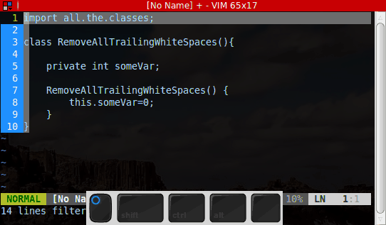
* F12 toggle visual whitespaces  
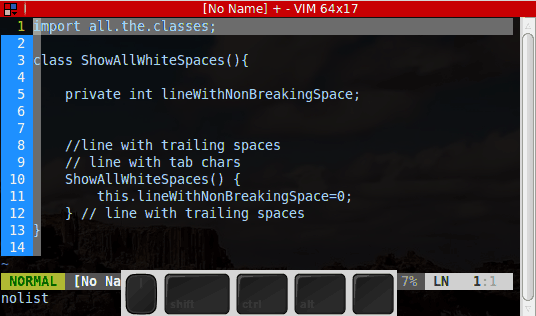
* press Asterisk to do a visual search  
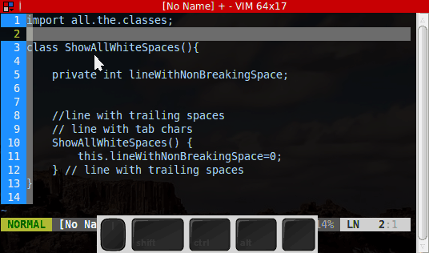
* ctrl+t+arrows move around tabs  
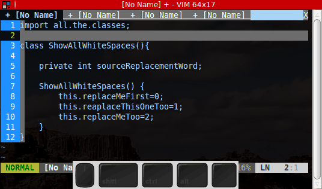
* :Dox generate doc template  
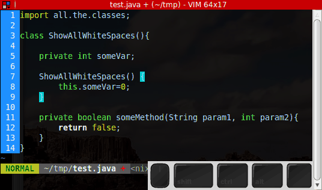
* R run python script from Vim  
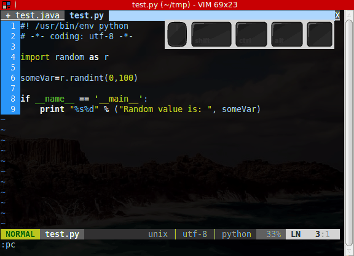
* play with EN spellcheker  
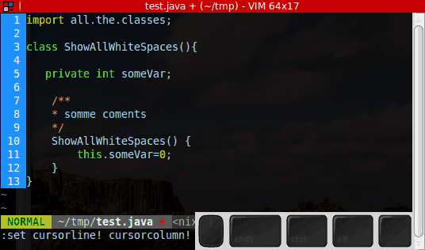
* ,+c toggle line and column highlight  
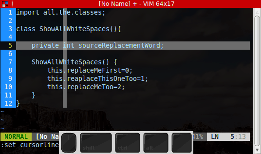
* iyw then S to replace word multiple time  
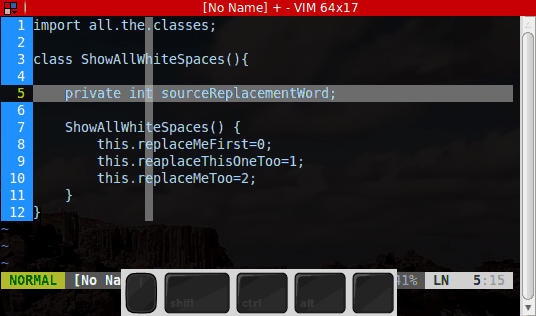
* move visual block with angle brackets  
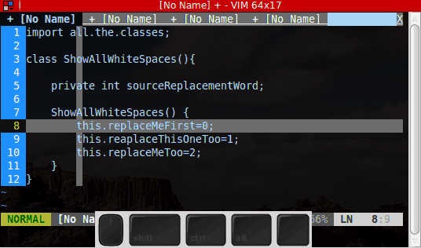

## Other tips & tricks

### Sync Tomboy Notes using Dropbox
1. create new folder in the Dropbox folder ie.: tomboy-notes
2. go to Tomboy'd preferences: Edit -> Preferences -> Synchronisation
3. Choose "Local folder" from the "Service" dropdown menu
4. Then point at the folder you've created in the first step
5. Hit "Close" and continue working :)


### Sync Tasque's DB using Dropbox
1. close tasque
2.  create new folder in the Dropbox folder ie.: tasque-db
3.  move contents of ~/.config/tasque folder to the newly created tasque-db dir
4.  delete the empty ~/.config/tasque
5.  create a symlink:

        ln -s /home/your_user_name/Dropbox/tasque-db tasque

6.  open tasque
